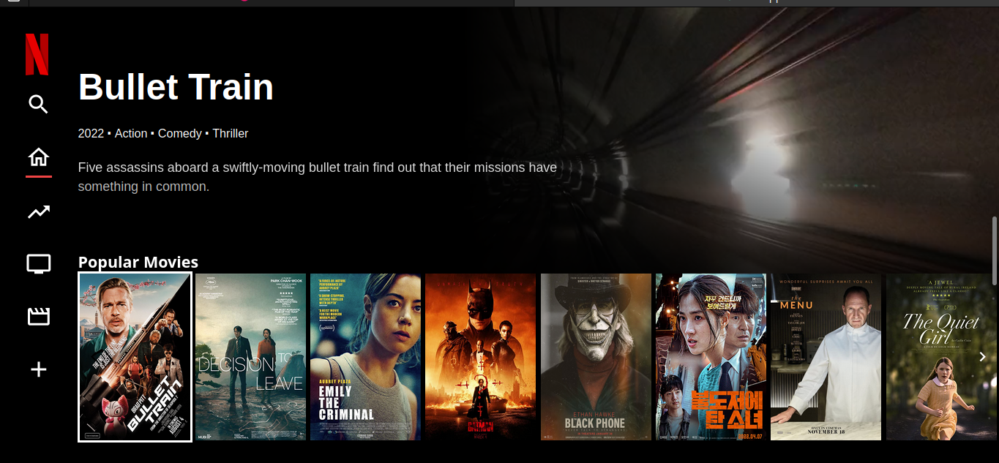

# Netflix Clone 🎥🍿

🚀 this is a simple netflix clone (tv version) i made using VUE.js, Vite, Tailwind CSS and pinia. 🎬🌟

## Overview 🌐

This project is a replica of Netflix's user interface, showcasing the use of modern frontend technologies like VUE.js to recreate the famous streaming platform's look and feel.

### 🖼️ Screenshots

### 📽️ Demo Video

[Watch Demo Video](DEMO/video-demo.mp4)

## Features 🛠️

- **Vue.js Framework:** Leveraged Vue.js for efficient and reactive UI components.
- **Tailwind CSS:** Used Tailwind CSS for rapid and responsive styling.
- **Vite:** Utilized Vite for a lightning-fast development environment setup.
- **Pinia:** Employed Pinia for state-of-the-art state management in the Vue.js application.

## Usage 🚀

To run this project locally, follow these steps:

1. Clone the repository: `git clone https://github.com/comethrusws/netflix-clone.git`
2. Navigate to the project directory: `cd netflix-clone`
3. Install dependencies: `npm install`
4. Run the development server: `npm run dev`
